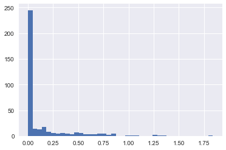

这一节我们将讨论使用布尔值掩码来操作数组， 掩码可以用于执行提取，修改，计数等操作。

## 示例

假设有一个数据集，保存了每个城市在一年中每天的降雨量，下面使用pandas读取西雅图在2014年的降雨量统计数据。

```python
import numpy as np
import pandas as pd

# use pandas to extract rainfall inches as a NumPy array
rainfall = pd.read_csv('data/Seattle2014.csv')['PRCP'].values
inches = rainfall / 254.0  # 1/10mm -> inches
inches.shape
```

这个数组包含了365个数值，代表了2014年1月1号到12月31号的降雨量数据。

```python
%matplotlib inline
import matplotlib.pyplot as plt
import seaborn; seaborn.set()  # set plot styles
```

绘制直方图：

```python
plt.hist(inches, 40);
```



直方图大概描述了数据长什么样子，大部分数据都分布在0附近，但是这并没有很好的展示我们想要的信息，比如一年中有多少天是雨天？雨天的平均降雨量是多少？有多少雨天的降水量超过了半英尺？

### 挖掘数据

一种解决办法是遍历数据，使用一个计数器统计信息，但是这样做得效率非常低。另一种方法是使用`Numpy`提供的掩码功能。

## 通用函数中的比较运算符

`Numpy`也支持比较操作运算，例如`>`或者`<`等。比较操作的结果是一个布尔数组，所有的标准比较运算都是支持的。

```python
x = np.array([1, 2, 3, 4, 5])
x < 3  # less than
# array([ True,  True, False, False, False], dtype=bool)
x > 3  # greater than
# array([False, False, False,  True,  True], dtype=bool)
x <= 3  # less than or equal
# array([False, False,  True,  True,  True], dtype=bool)
x != 3  # not equal
# array([ True,  True, False,  True,  True], dtype=bool)
x == 3  # equal
# array([False, False,  True, False, False], dtype=bool)
```

也可以在比较操作中使用组合表达式：

```
(2 * x) == (x ** 2)
# (2 * x) == (x ** 2)
```

`Numpy`也提供了对应的比较函数，如下表所示：

| 操作符    | 等价函数           |      | 操作符    | 等价函数                 |
| ------ | -------------- | ---- | ------ | -------------------- |
| ``==`` | ``np.equal``   |      | ``!=`` | ``np.not_equal``     |
| ``<``  | ``np.less``    |      | ``<=`` | ``np.less_equal``    |
| ``>``  | ``np.greater`` |      | ``>=`` | ``np.greater_equal`` |

比较操作同样支持多维数组：

```python
rng = np.random.RandomState(0)
x = rng.randint(10, size=(3, 4))
x < 6
```

结果是一个多维的布尔数组。

## 使用布尔数组

### 计数

通过`np.count_nonzero`来计算布尔数组中`True`的个数。

```python
# how many values less than 6?
np.count_nonzero(x < 6) # 8
```

等价于调用`np.sum`方法，`False`被当做0处理，`True`当做1处理。

```python
np.sum(x < 6)  # 8
```

`np.sum`的好处是可以指定轴，下面计算每行小于6的元素个数。

```python
# how many values less than 6 in each row?
np.sum(x < 6, axis=1)  # array([4, 2, 2])
```

如果需要检查所有的元素，则可以调用`np.any`或者`np.all`方法。

```python
# are there any values greater than 8?
np.any(x > 8)  # True
# are there any values less than zero?
np.any(x < 0)  # False
# are all values less than 10?
np.all(x < 10)  # True
# are all values equal to 6?
np.all(x == 6)  # False
```

`np.all`和`np.any`也可以指定轴向进行计算：

```python
# are all values in each row less than 8?
np.all(x < 8, axis=1)
# array([ True, False,  True], dtype=bool)
```

### 布尔操作符

现在我们已经知道怎样计算降雨量小于四英尺的下雨天数，以及降雨量大于2英尺的天数。但是假如我想知道降雨量大于2英尺但是小于4英尺的天数呢？这可以通过Python的逻辑位运算符实现(`&`, `|`, `~`)。`Numpy`重载了这些方法。

例如：

```python
np.sum((inches > 0.5) & (inches < 1))  # 29
```

注意这里的括号非常重要，因为逻辑位运算符的优先级比较低。

上面的例子等价于：

```python
np.sum(~( (inches <= 0.5) | (inches >= 1) ))
```

通过组合使用逻辑位运算符和布尔操作运算符，可以创建非常复杂的逻辑运算。

| 运算符   | 等价通用函数             |      | 运算符   | 等价通用函数             |
| ----- | ------------------ | ---- | ----- | ------------------ |
| ``&`` | ``np.bitwise_and`` |      | \|    | ``np.bitwise_or``  |
| ``^`` | ``np.bitwise_xor`` |      | ``~`` | ``np.bitwise_not`` |

使用这些工具函数，我们就可以很方便的计算各种统计信息了。

```python
print("Number days without rain:      ", np.sum(inches == 0))
print("Number days with rain:         ", np.sum(inches != 0))
print("Days with more than 0.5 inches:", np.sum(inches > 0.5))
print("Rainy days with < 0.2 inches  :", np.sum((inches > 0) &
                                                (inches < 0.2)))
```

结果如下：

```
Number days without rain:       215
Number days with rain:          150
Days with more than 0.5 inches: 37
Rainy days with < 0.2 inches  : 75
```

## 布尔数组掩码

前面我们学习了直接作用在布尔数组的聚合运算，更强大的用法是使用布尔数组作为掩码来操作数组。回到之前的数组`x`， 选取数组中值小于5的元素。

```python
x < 5
```

结果为：

```python
array([[False,  True,  True,  True],
       [False, False,  True, False],
       [ True,  True, False, False]], dtype=bool)
```

然后使用这个布尔数组作为索引，选取元素。

```python
x[x < 5]  # array([0, 3, 3, 3, 2, 4])
```

返回的数组是一个一维数组，其中的数据为满足条件的元素。

通过掩码可以灵活的操作数据。

```python
# construct a mask of all rainy days
rainy = (inches > 0)

# construct a mask of all summer days (June 21st is the 172nd day)
days = np.arange(365)
summer = (days > 172) & (days < 262)

print("Median precip on rainy days in 2014 (inches):   ",
      np.median(inches[rainy]))
print("Median precip on summer days in 2014 (inches):  ",
      np.median(inches[summer]))
print("Maximum precip on summer days in 2014 (inches): ",
      np.max(inches[summer]))
print("Median precip on non-summer rainy days (inches):",
      np.median(inches[rainy & ~summer]))
```

结果为：

```python
Median precip on rainy days in 2014 (inches):    0.194881889764
Median precip on summer days in 2014 (inches):   0.0
Maximum precip on summer days in 2014 (inches):  0.850393700787
Median precip on non-summer rainy days (inches): 0.200787401575
```

### `and/or`和`&/|`的区别

`and/or`是作为一个整体进行逻辑运算，而`&/|`是对每个元素进行逻辑位运算。所以`Numpy`中只能采用`&/|`尽心逻辑运算。

