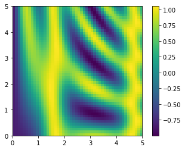

广播指将一组规则应用于对不同大小的数组调用通用函数的过程中。

## 广播简介

对于相同大小的数组，二元操作是基于数组元素一一对应进行操作的。

```python
import numpy as np
a = np.array([0, 1, 2])
b = np.array([5, 5, 5])
a + b
```

结果为：

```python
array([5, 6, 7])
```

广播允许这些二元操作作用在不同大小的数组上。例如，我们可以将一个标量和一个数组相加：

```python
a + 5
# array([5, 6, 7])
```

我们可以将5看成数组`[5,5,5]`与`a`相加。广播实际上并没有做这一步操作，但是我们这样想的话比较容易理解。

同样我们可以将这扩展到高纬度的数组，查看下面操作的结果：

```python
M = np.ones((3, 3))
M
```

结果为：

```
array([[ 1.,  1.,  1.],
       [ 1.,  1.,  1.],
       [ 1.,  1.,  1.]])
```

```
M + a
```

结果为：

```
array([[ 1.,  2.,  3.],
       [ 1.,  2.,  3.],
       [ 1.,  2.,  3.]])
```

这里数组`a`进行了扩展，或者说沿第二维度进行了广播，以匹配M的形状。

上面的例子比较好理解，接下来讲一个复杂的例子：

```python
a = np.arange(3)
b = np.arange(3)[:, np.newaxis]

print(a)
print(b)
```

输出为：

```
[0 1 2]
[[0]
 [1]
 [2]]
```

执行加法操作：

```
a + b
```

结果为：

```
array([[0, 1, 2],
       [1, 2, 3],
       [2, 3, 4]])
```

这里我们同时对a和b进行了广播，以匹配共同的形状，所以结果是一个二维数组。


上面颜色比较淡的方块代表了广播值，实际上并没有分配格外的内存，但是有利于理解。

## 广播的规则

广播严格遵守以下规则：

- 规则1：如果两个数组有只是维度的个数不一致，维度较少的数组需要在左边补齐缺少的维度。
- 规则2：如果两个数组的形状在任何维度上都不一致，则包含维度为一的数组，在这个维度需要扩展已匹配另外一个数组的形状。
- 规则3：如果不管在任何维度上，两个数组的大小都不一致，并且也不等于1，则抛出异常。

考虑下面的例子:

**示例1**

将一个二维数组和一个一维数组相加。

```python
M = np.ones((2, 3))
a = np.arange(3)
```

这两个数组的形状分别为：

```python
M.shape = (2, 3)
a.shape = (3,)
```

按照规则1，数组`a`的维度个数比`M`少，所以在左边补齐维度：

```
M.shape -> (2, 3)
a.shape -> (1, 3)
```

然后再看规则2，可以看出第一个维度不匹配，扩展维度为1的数组：

```
M.shape -> (2, 3)
a.shape -> (2, 3)
```

所以最终广播之后的形状为`(2,3)`，所以

```python
M + a
```

结果为：

```
array([[ 1.,  2.,  3.],
       [ 1.,  2.,  3.]])
```

**示例2**

这个例子里面，两个数组都需要进行广播：

```
a = np.arange(3).reshape((3, 1))
b = np.arange(3)
```

首先，写出两个数组的形状：

```
a.shape = (3, 1)
b.shape = (3,)
```

按照规则1，`b`需要进行扩展：

```
a.shape -> (3, 1)
b.shape -> (1, 3)
```

按照规则2， 两个数组都需要扩展相应的维度大小：

```
a.shape -> (3, 3)
b.shape -> (3, 3)
```

所以：

```python
a + b
```

结果为：

```python
array([[0, 1, 2],
       [1, 2, 3],
       [2, 3, 4]])
```

**示例3**

这个例子展示不匹配的两个数组：

```
M = np.ones((3, 2))
a = np.arange(3)
```

首先，查看两个数组的形状：

```python
M.shape = (3, 2)
a.shape = (3,)
```

按照规则1， 补齐数组`a`左边的维度：

```
M.shape -> (3, 2)
a.shape -> (1, 3)
```

按照规则2，扩展维度为1的数组：

```
M.shape -> (3, 2)
a.shape -> (3, 3)
```

按照规则3，最终的形状不匹配，所以执行加法的时候会抛出异常。

注意上面的规则不仅仅是针对加法，它也适用任意的所有的二元通用函数。

## 广播实战

### 中心化数组

假设有10组样本数据，每组数据包含三个值，将这10组数据存储为10 x 3 的数组：

```
X = np.random.random((10, 3))
```

使用`mean`聚合操作计算每个特征值的平均值：

```
Xmean = X.mean(0)
Xmean
# array([ 0.59766726,  0.51907156,  0.40581903])
```

然后中心化数组：

```
X_centered = X - Xmean
```

为了检查代码的正确性，可以查看中心化之后的数据平均值是否接近0；

```
X_centered.mean(0)
# array([  3.33066907e-17,   6.66133815e-17,   0.00000000e+00])
```

**使用二维函数绘图**

广播还可以用于基于二维函数绘制图片，假设定义函数`z=f(x,y)`：

```python
# x and y have 50 steps from 0 to 5
x = np.linspace(0, 5, 50)
y = np.linspace(0, 5, 50)[:, np.newaxis]

z = np.sin(x) ** 10 + np.cos(10 + y * x) * np.cos(x)
```

使用`matplotlib`绘制这个二维数组：

```python
%matplotlib inline
import matplotlib.pyplot as plt
plt.imshow(z, origin='lower', extent=[0, 5, 0, 5],
           cmap='viridis')
plt.colorbar();
```

结果如下图所示：

